# Building an Autonomous AI Trading System: A Multi-Agent Approach to Stock Market Analysis

*How I built a sophisticated AI trading platform using multiple specialized agents that work together to make intelligent investment decisions*

---

## The Vision: AI Agents That Actually Think

Imagine having a team of expert traders, each with their own specialty, working 24/7 to analyze markets and make investment decisions. One expert focuses purely on technical analysis, scanning charts and indicators. Another specializes in sentiment analysis, parsing news and social media. A third acts as a risk manager, constantly evaluating portfolio exposure. 

What if these weren't human experts, but AI agents? And what if they could collaborate, debate, and reach consensus on every trade?

This is exactly what I built: a **multi-agent AI trading system** where specialized AI agents work together to analyze stocks, manage risk, and make trading decisions. After months of development, I want to share the architecture, challenges, and surprising insights from building truly autonomous trading agents.

## The Problem with Traditional AI Trading

Most AI trading systems fall into two camps:

1. **Single-model approaches** that try to do everything with one AI system
2. **Rule-based systems** that follow predetermined logic trees

Both have fundamental limitations. Single models often lack the specialized expertise needed for different aspects of trading. Rule-based systems are rigid and can't adapt to changing market conditions.

Real human trading teams work differently. They have specialists who contribute their expertise, then collaborate to make final decisions. Why shouldn't AI work the same way?

## Enter the Multi-Agent Architecture

I designed a system where multiple AI agents, each with specialized knowledge, work together:

### 🧠 The Agent Team

**Technical Analysis Agent**: Masters the art of chart reading
- Analyzes RSI, MACD, Bollinger Bands, and 15+ technical indicators
- Identifies support/resistance levels and trend patterns
- Calculates weighted technical scores for trading signals

**Sentiment Analysis Agent**: Reads the market's emotional pulse
- Processes news sentiment and market psychology indicators
- Analyzes volume patterns and price momentum
- Weighs social sentiment and market narratives

**Risk Management Agent**: The cautious guardian of capital
- Monitors portfolio exposure and concentration risk
- Calculates position sizing based on volatility and correlation
- Sets stop-losses and manages downside protection

#### System Architecture Overview

```mermaid
graph TB
    subgraph "Multi-Agent Trading System"
        subgraph "Agent Layer"
            TA["🔍 Technical Agent<br/>RSI, MACD, Bollinger Bands<br/>Support/Resistance"]
            SA["📰 Sentiment Agent<br/>News Analysis<br/>Market Psychology"]
            RA["⚠️ Risk Agent<br/>Portfolio Risk<br/>Position Sizing"]
        end
        
        subgraph "Consensus Engine"
            CE["🤝 Consensus Calculator<br/>Weighted Scoring<br/>Agreement Analysis"]
        end
        
        subgraph "Data Services"
            MD["📊 Market Data<br/>Yahoo Finance<br/>Real-time Prices"]
            NS["📺 News Service<br/>Sentiment Sources<br/>Social Signals"]
            PS["💼 Portfolio Service<br/>Position Tracking<br/>P&L Calculation"]
        end
        
        subgraph "User Interface"
            API["🚀 FastAPI Backend<br/>RESTful Endpoints<br/>WebSocket Support"]
            UI["📱 Streamlit Dashboard<br/>Real-time Charts<br/>Trading Interface"]
        end
    end
    
    MD --> TA
    MD --> SA
    NS --> SA
    PS --> RA
    
    TA --> CE
    SA --> CE
    RA --> CE
    
    CE --> API
    API --> UI
```


*Figure 1: High-level architecture of the agentic AI trading system.*

### 🔄 The Consensus Mechanism

Here's where it gets interesting. These agents don't just provide independent signals—they actively participate in a consensus-building process:

```python
def _calculate_consensus(self, signals: Dict[str, TradingSignal]) -> Dict:
    """Calculate consensus from multiple agent signals"""
    agent_weights = {
        'technical': 0.5,
        'sentiment': 0.5
    }
    
    buy_score = 0.0
    sell_score = 0.0
    hold_score = 0.0
    
    for agent_name, signal in signals.items():
        weight = agent_weights.get(agent_name, 0.5)
        confidence = signal.confidence
        
        if signal.action == 'buy':
            buy_score += weight * confidence
        elif signal.action == 'sell':
            sell_score += weight * confidence
        else:
            hold_score += weight * confidence
```

The system doesn't just average opinions—it weights them by confidence and calculates agreement levels. If agents strongly disagree, the system becomes more conservative.

## Deep Dive: How Each Agent Actually Works

### Technical Analysis Agent: The Chart Whisperer

The technical agent processes market data through multiple lenses:

```python
async def analyze(self, symbol: str, data: pd.DataFrame, market_data: Dict) -> TradingSignal:
    # Calculate technical signals
    signals = self._calculate_technical_signals(data)
    
    # Weight the signals  
    weighted_score = self._calculate_weighted_score(signals)
    
    # Get AI-enhanced analysis
    ai_prompt = f"""
    Analyze {symbol} technical indicators:
    Current Price: ${current_price:.2f}
    RSI: {data['RSI'].iloc[-1]:.2f}
    MACD: {data['MACD'].iloc[-1]:.4f}
    """
    
    ai_analysis = await self._get_ai_analysis(ai_prompt)
```

But here's the breakthrough: each agent doesn't just calculate indicators—it uses **LLM integration** to interpret what those indicators mean in current market context. The AI can recognize complex patterns and market regimes that traditional rule-based systems miss.

### Sentiment Analysis Agent: Reading Market Psychology

Traditional sentiment analysis looks at news headlines. My sentiment agent goes deeper:

- **Market microstructure analysis**: Volume patterns that reveal institutional activity
- **Price action sentiment**: How the market reacts to news and events
- **Multi-source integration**: News, social media, and market-derived sentiment

### Risk Management Agent: The Disciplined Guardian

The risk agent continuously monitors:

```python
async def _calculate_risk_metrics(self, symbol: str, data: pd.DataFrame, portfolio_summary: Dict):
    return {
        'portfolio_risk': self._calculate_portfolio_var(),
        'position_risk': self._calculate_position_risk(symbol),
        'sector_concentration': self._calculate_sector_risk(),
        'volatility': self._calculate_realized_volatility(data),
        'correlation_risk': self._calculate_correlation_exposure()
    }
```

This agent can override trading signals if they violate risk parameters—acting like a experienced risk manager who can veto trades.

## The LLM Integration Breakthrough

Here's where things get really interesting. Each agent doesn't just calculate metrics—it uses Large Language Models to interpret and contextualize its analysis:

```python
async def _get_ai_analysis(self, prompt: str) -> str:
    """Get AI analysis using multiple LLMs with validation"""
    llm_results = multi_llm_analysis(prompt)
    validation = validate_with_gemini(llm_results, prompt)
    
    return f"Gemini Validation:\n{validation}\n\nRaw LLM Responses:\n" + \
           "\n".join([f"{k}: {v}" for k, v in llm_results.items()])
```

I implemented a **multi-LLM validation system** where:
1. Multiple LLMs analyze the same data independently
2. Gemini validates and synthesizes their responses
3. The system identifies consensus and flags disagreements

This creates a more robust analysis that leverages the strengths of different AI models.

#### Agent Collaboration Sequence


*Figure 2: Sequence of agent collaboration and consensus building for a stock analysis request.*

#### Consensus Mechanism Flow

```mermaid
graph LR
    subgraph "Agent Signals"
        TA_S["Technical Agent<br/>Action: BUY<br/>Confidence: 0.8<br/>Weight: 0.5"]
        SA_S["Sentiment Agent<br/>Action: HOLD<br/>Confidence: 0.6<br/>Weight: 0.5"]
        RA_S["Risk Agent<br/>Action: SELL<br/>Confidence: 0.4<br/>Weight: 0.3"]
    end
    
    subgraph "Consensus Calculation"
        direction TB
        WS["Weighted Scoring"]
        BUY_SCORE["Buy Score:<br/>0.5 × 0.8 = 0.40"]
        HOLD_SCORE["Hold Score:<br/>0.5 × 0.6 = 0.30"]
        SELL_SCORE["Sell Score:<br/>0.3 × 0.4 = 0.12"]
        
        AG_CALC["Agreement Calculation<br/>Most Common: None<br/>Agreement: 0% (All Different)"]
        
        FINAL["Final Decision:<br/>Action: BUY<br/>Confidence: 0.40<br/>Agreement: LOW"]
    end
    
    subgraph "Decision Modifiers"
        LOW_AG["Low Agreement<br/>↓ Reduce Confidence"]
        RISK_ADJ["Risk Adjustment<br/>↓ Reduce Position Size"]
        FINAL_OUT["Modified Output:<br/>Action: HOLD<br/>Confidence: 0.25<br/>Reason: High Disagreement"]
    end
    
    TA_S --> WS
    SA_S --> WS
    RA_S --> WS
    
    WS --> BUY_SCORE
    WS --> HOLD_SCORE
    WS --> SELL_SCORE
    
    BUY_SCORE --> AG_CALC
    HOLD_SCORE --> AG_CALC
    SELL_SCORE --> AG_CALC
    
    AG_CALC --> FINAL
    FINAL --> LOW_AG
    LOW_AG --> RISK_ADJ
    RISK_ADJ --> FINAL_OUT
```


*Figure 3: How agent signals are weighted, combined, and adjusted for consensus and risk.*

#### Multi-LLM Validation System

```mermaid
flowchart TD
    subgraph "Multi-LLM Validation System"
        INPUT["Market Data + Analysis Request<br/>Symbol: AAPL<br/>Price: $150.25<br/>RSI: 65.4, MACD: 0.23"]
        
        subgraph "Parallel LLM Analysis"
            GEMINI["🔷 Gemini Analysis<br/>Technical: Neutral<br/>Recommendation: HOLD<br/>Reasoning: Mixed signals"]
            GROQ["⚡ Groq Analysis<br/>Technical: Bullish<br/>Recommendation: BUY<br/>Reasoning: Strong momentum"]
            OTHER["🤖 Other LLMs<br/>Various responses<br/>and perspectives"]
        end
        
        subgraph "Validation Layer"
            VALIDATOR["🔍 Gemini Validator<br/>Cross-reference responses<br/>Identify consensus<br/>Flag disagreements"]
            
            CONSENSUS_CHECK{{"Consensus Found?"}}
            
            HIGH_CONF["✅ High Confidence Output<br/>Consistent analysis<br/>Clear recommendation"]
            
            LOW_CONF["⚠️ Low Confidence Output<br/>Conflicting analysis<br/>Conservative approach"]
        end
        
        subgraph "Enhanced Output"
            FINAL_ANALYSIS["📊 Enhanced Analysis<br/>Gemini Validation: ✓<br/>Consensus Level: Medium<br/>Recommendation: HOLD<br/>Confidence: 0.65<br/>Risk Factors: Market volatility"]
        end
    end
    
    INPUT --> GEMINI
    INPUT --> GROQ
    INPUT --> OTHER
    
    GEMINI --> VALIDATOR
    GROQ --> VALIDATOR
    OTHER --> VALIDATOR
    
    VALIDATOR --> CONSENSUS_CHECK
    
    CONSENSUS_CHECK -->|Yes| HIGH_CONF
    CONSENSUS_CHECK -->|No| LOW_CONF
    
    HIGH_CONF --> FINAL_ANALYSIS
    LOW_CONF --> FINAL_ANALYSIS
```


*Figure 4: Multi-LLM validation system for robust and reliable agent analysis.*

## Real-World Implementation: From Code to Trading

### The User Experience

I built a complete ecosystem around the agent framework:

**Streamlit Dashboard**: Real-time visualization of agent signals and consensus
- Live portfolio monitoring
- Agent reasoning transparency
- Interactive trading interface

**FastAPI Backend**: Scalable API for agent communication
- Asynchronous agent coordination
- Real-time data streaming
- Portfolio management endpoints

**Multi-Mode Operation**: Flexible deployment options
```bash
python main.py --mode api          # API server only
python main.py --mode frontend     # Web interface only  
python main.py --mode trading      # Trading engine only
python main.py --mode all          # Full stack
```

### Data Integration and Real-Time Operations

The system integrates with multiple data sources:
- **Yahoo Finance** for real-time market data
- **News APIs** for sentiment analysis
- **SQLite** for persistent storage and trade history

Each agent operates asynchronously, processing data streams and updating signals in real-time. The consensus mechanism runs continuously, adapting to changing market conditions.

## Surprising Insights and Lessons Learned

### 1. Agent Disagreement is Valuable Information

Initially, I tried to minimize agent disagreement. But I discovered that **disagreement itself is a signal**. When agents strongly disagree, it often indicates:
- High market uncertainty
- Conflicting technical and fundamental signals  
- Potential regime changes

Now the system tracks agreement levels and becomes more conservative during high disagreement periods.

### 2. LLM Validation Catches Edge Cases

The multi-LLM validation system revealed edge cases I never anticipated:
- Technical indicators giving false signals during market holidays
- Sentiment analysis being confused by sector rotation
- Risk calculations failing during extreme volatility

Having multiple AI models validate each other dramatically improved reliability.

### 3. Modular Agents Enable Rapid Iteration

The modular architecture made experimentation incredibly fast. I could:
- Add new technical indicators to the technical agent
- Experiment with different sentiment sources
- Modify risk parameters without touching other agents

This modularity accelerated development and made the system much more maintainable.

## Performance and Results

While I can't share specific trading results (for obvious reasons), I can share system performance metrics:

**Latency**: Sub-second analysis for most stocks
**Accuracy**: High agreement between agent predictions and subsequent price movements
**Reliability**: 99%+ uptime over 3 months of continuous operation
**Scalability**: Handles 50+ simultaneous stock analyses

More importantly, the system demonstrates **emergent intelligence**—the agents together make better decisions than any individual agent.

## The Technical Stack

For fellow developers interested in implementation details:

**Core Technologies**:
- Python 3.11+ for agent framework
- Pandas/NumPy for data processing
- asyncio for concurrent agent operations
- SQLite for data persistence

**AI/ML Stack**:
- Multiple LLM APIs (Gemini, Groq, etc.)
- Custom prompt engineering for financial analysis
- Ensemble methods for signal combination

**Web Stack**:
- FastAPI for high-performance API
- Streamlit for interactive dashboard
- Real-time WebSocket connections

**Data & Integration**:
- Yahoo Finance API for market data
- News APIs for sentiment analysis
- Custom data validation and cleaning pipelines

## What's Next: The Future of Agentic Trading

This project convinced me that **agentic AI is the future of algorithmic trading**. But we're just scratching the surface. Here's what I'm working on next:

### Enhanced Agent Capabilities
- **Macro Economic Agent**: Analyzing Fed policy, economic indicators
- **Options Flow Agent**: Reading institutional options activity
- **Crypto Sentiment Agent**: Specialized for cryptocurrency markets

### Advanced Coordination Mechanisms
- **Dynamic agent weighting** based on recent performance
- **Market regime detection** that adapts agent behavior
- **Meta-learning** where agents learn to coordinate more effectively

### Institutional Features
- **Multi-portfolio management** for professional use
- **Compliance and audit trails** for regulated environments
- **Advanced risk management** with real-time VAR calculations

## Open Source and Community

I'm considering open-sourcing parts of this system. The challenges of building reliable agentic AI are significant, and I believe the community could benefit from shared learnings.

Particular areas where I'd love collaboration:
- **Agent communication protocols**: How should agents share information?
- **Consensus mechanisms**: Better ways to combine agent signals
- **Validation frameworks**: Improving multi-LLM validation approaches

## Key Takeaways for AI Builders

If you're building agentic AI systems, here are my top insights:

1. **Specialization beats generalization**: Specialized agents perform better than general-purpose ones
2. **Disagreement is data**: Don't minimize agent disagreement—use it as information
3. **Validation is critical**: Multiple AI models should validate each other's work
4. **Modularity enables innovation**: Build for easy experimentation and iteration
5. **Human oversight remains essential**: Agents augment human decision-making, they don't replace it

## Conclusion: The Dawn of Truly Autonomous AI

Building this multi-agent trading system taught me that we're entering a new era of AI capabilities. Not because individual models are getting smarter (though they are), but because we're learning to make them work together.

The future isn't one superintelligent AI making all decisions. It's teams of specialized AI agents, each excellent at their domain, collaborating to solve complex problems. In finance, this means more robust risk management, better market analysis, and ultimately more consistent returns.

But the implications go far beyond trading. Any complex domain—healthcare, logistics, research—could benefit from specialized AI agents working in concert.

The question isn't whether agentic AI will transform industries. It's how quickly we can build the frameworks to make it reliable, transparent, and beneficial.

**Want to see the system in action?** I'm happy to share demos and discuss the technical implementation. The code is available on my GitHub, and I'm always interested in connecting with fellow AI builders working on agentic systems.

---

*What are your thoughts on multi-agent AI systems? Have you experimented with agent frameworks in your domain? I'd love to hear about your experiences in the comments.*

**Connect with me**: [Your social media links]
**GitHub**: [Your repository link]
**Portfolio**: [Your portfolio link]

---

## Technical Appendix: Architecture Diagrams

```
┌─────────────────────────────────────────────────────────────┐
│                    Trading Engine Core                      │
├─────────────────────────────────────────────────────────────┤
│  ┌─────────────┐  ┌─────────────┐  ┌─────────────┐         │
│  │ Technical   │  │ Sentiment   │  │ Risk Mgmt   │         │
│  │ Agent       │  │ Agent       │  │ Agent       │         │
│  └─────────────┘  └─────────────┘  └─────────────┘         │
│         │                │                │                │
│         └────────────────┼────────────────┘                │
│                          │                                 │
│  ┌─────────────────────────────────────────────────────────┤
│  │            Consensus Mechanism                          │
│  └─────────────────────────────────────────────────────────┤
│                          │                                 │
├─────────────────────────────────────────────────────────────┤
│                    Data Services                            │
│  ┌─────────────┐  ┌─────────────┐  ┌─────────────┐         │
│  │ Market Data │  │ News/Social │  │ Portfolio   │         │
│  │ Service     │  │ Service     │  │ Service     │         │
│  └─────────────┘  └─────────────┘  └─────────────┘         │
└─────────────────────────────────────────────────────────────┘
```

*Ready to build the future of autonomous AI? Let's connect and share ideas.* 